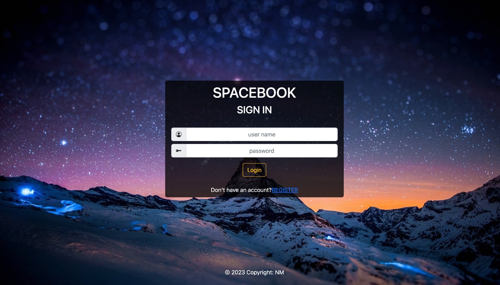
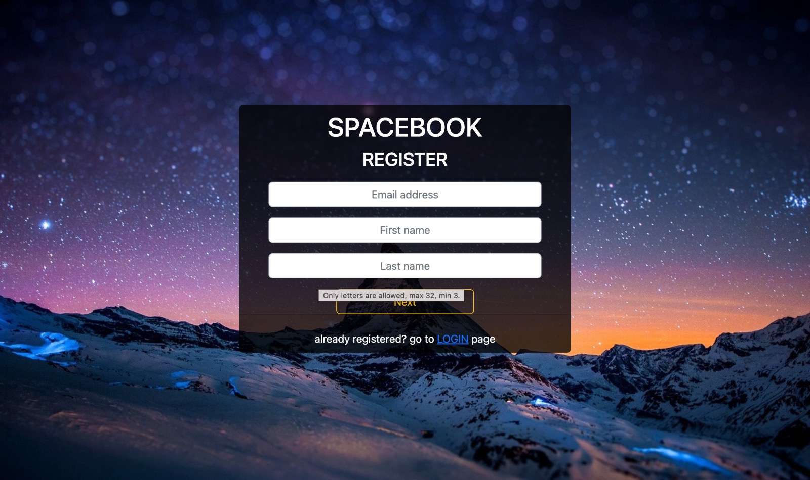
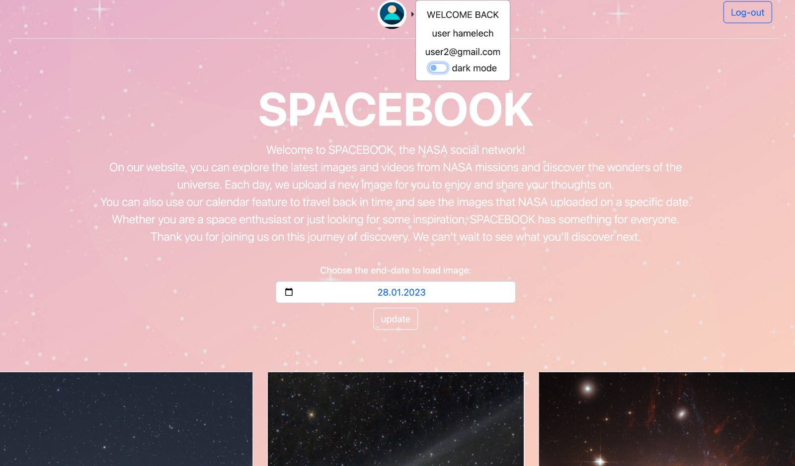
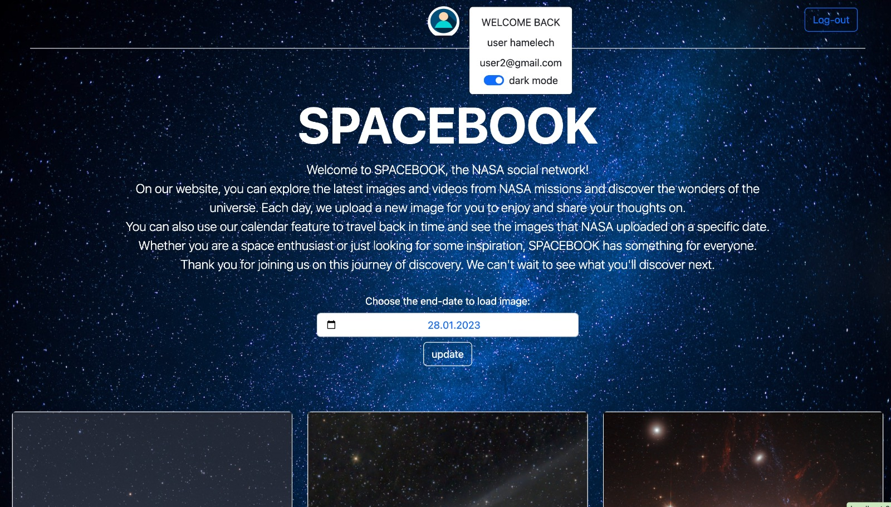
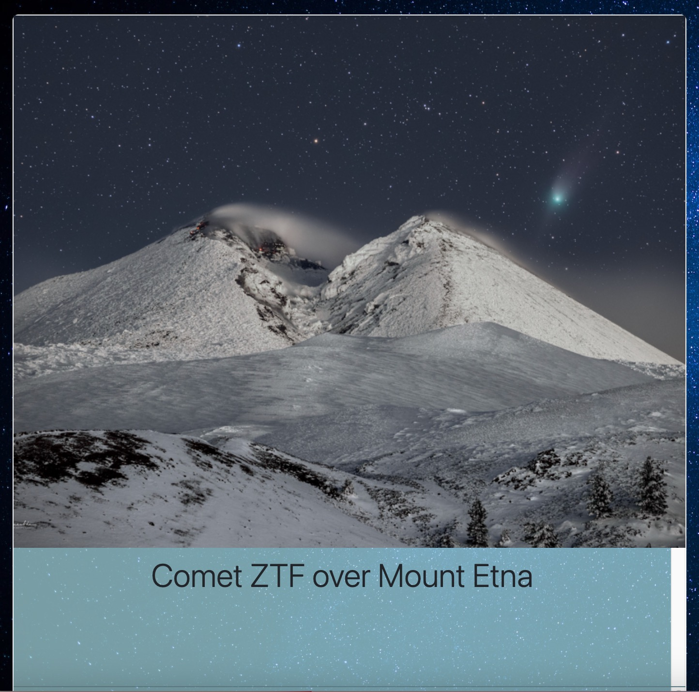
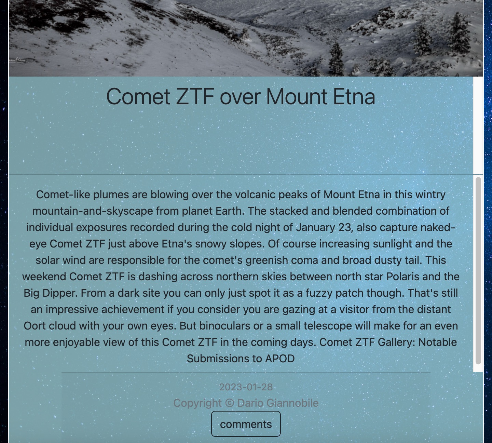

[

# ⭐️⭐️⭐️ EX6 - SPACEBOOK 🌎 🌍 🌏

<h1>Noam Mirjani <br> id: 315216515 <br> Email: Noammir@edu.hac.ac.il</h1>

<h2> Description 📚</h2>

> This code creates a login page and a page to view NASA's Astronomy Picture of the Day (APOD). The login page has a form for the user to enter their name, and it checks to make sure the name is a string of exactly 24 letters and digits. If the name is valid, the login page removes any error messages and submits the form. If the name is not valid, the login page displays an error message and highlights the input field as invalid. <br/>
> The APOD page allows the user to choose a date and displays up to 2 APOD images for that date. It makes a fetch request to the NASA APOD API to get the data for the selected date, and it displays the images and associated information in the page. If there is an error in the fetch request, it displays an error message. The page also has a "Load More" button that allows the user to view additional images for the selected date.

<h2> Installation 🛠️</h2>

> To run this code, you will need an API key from NASA's APOD API. You can get a key by following the instructions here. Once you have your API key, replace YOUR_API_KEY_HERE in the following line of code with your actual API key:<br><br>
> const APIKEY = "YOUR_API_KEY_HERE"; (ex5.js line-1)
> <br><br>
> To use this code, open the index.html file in a web browser. Enter your name in the login form and click the "Submit" button. If your name is a string of exactly 24 letters and digits, you will be taken to the APOD page. Select a date from the dropdown menu and click the "Go" button to view the APOD images for that date. You can click the "Load More" button to view additional images for the selected date.

<h2> Credits🎗 </h2>

> This code was developed using the NASA APOD API.

<h2> License </h2>

> This code is available under the MIT License.

<h1 align="center">Usage<h1>
<h2 align="center">Cloning the repository</h2>

#### Clone the repository using the command below

```bash
git clone https://github.com/Solange-s-Courses/ex6-express-neviiim-ex6_noam_mirjani.git

```

#### Move into the directory where we have the project files

```bash
cd ex6-express-neviiim-ex6_noam_mirjani
```

#### Run npm install to install and dependence's

```bash
npm install
```

<h1 align="center">App Preview</h1>

<table width="100%"> 
<tr>
<td width="50%">      
&nbsp; 
<br>
<p align="center">
    Home page Preview
</p>
</p>

</td> 
<td width="50%">
<br>
<p align="center">
  Registration page Preview
</p>
  
</td>
</table>

<table width="100%"> 
<tr>
<td width="50%">      
&nbsp; 
<br>
<p align="center">
    Home page Preview (Light mode)
</p>
</p>

</td> 
<td width="50%">
<br>
<p align="center">
  Home page Preview (Dark mode)
</p>
  
</td>
</table>

<table width="100%"> 
<tr>
<td width="50%">      
&nbsp; 
<br>
<p align="center">
  Card firt part
</p>
</p>
  
</td> 
<td width="50%">
<br>
<p align="center">
  Card second part
</p>
  
</td>
</table>
