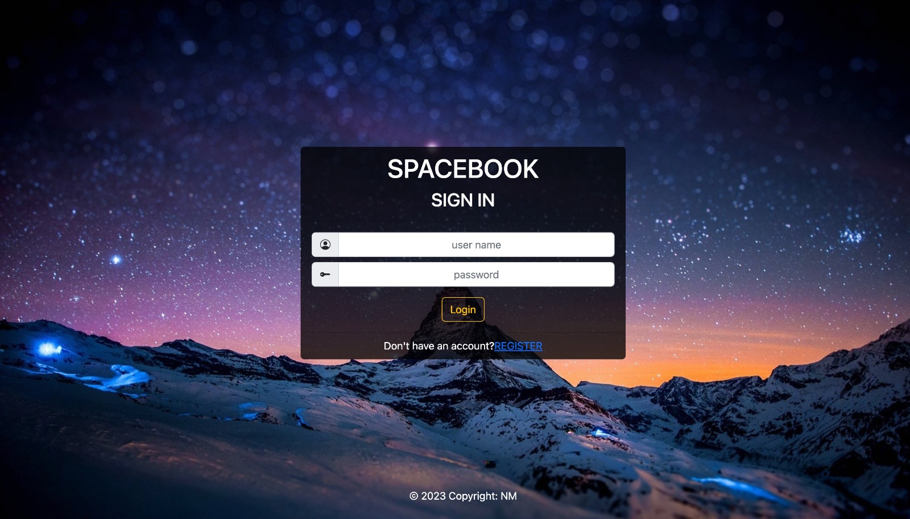
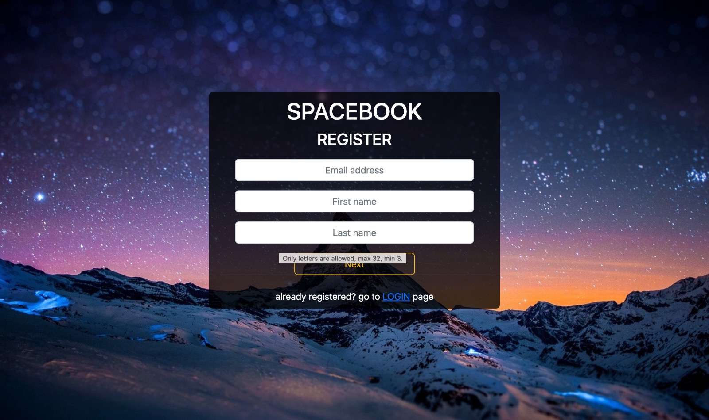
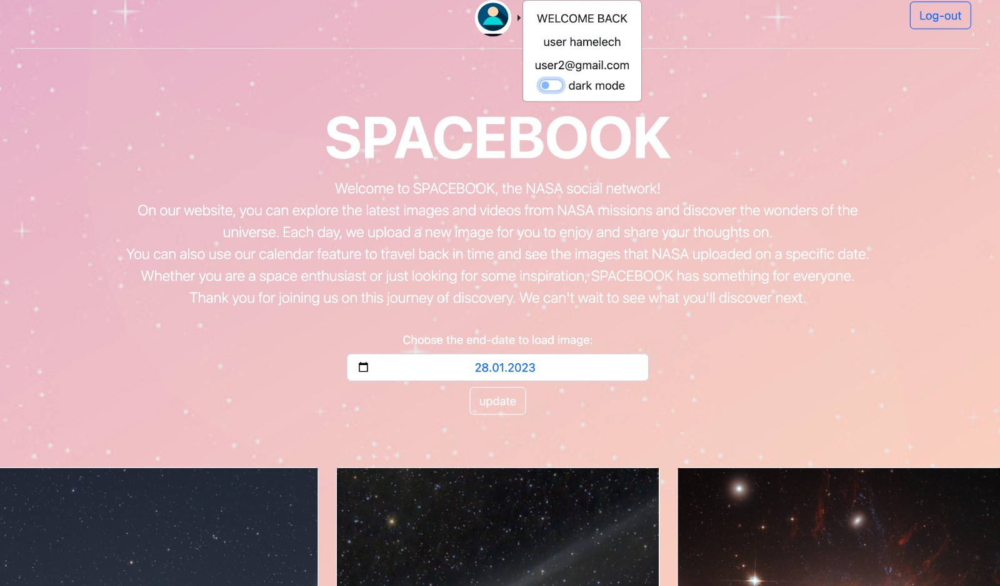
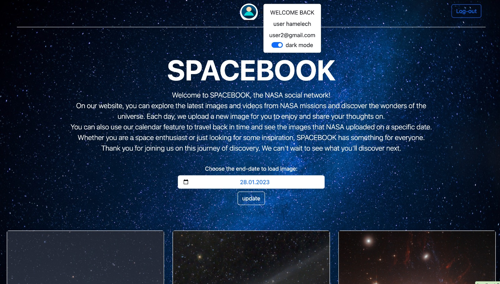
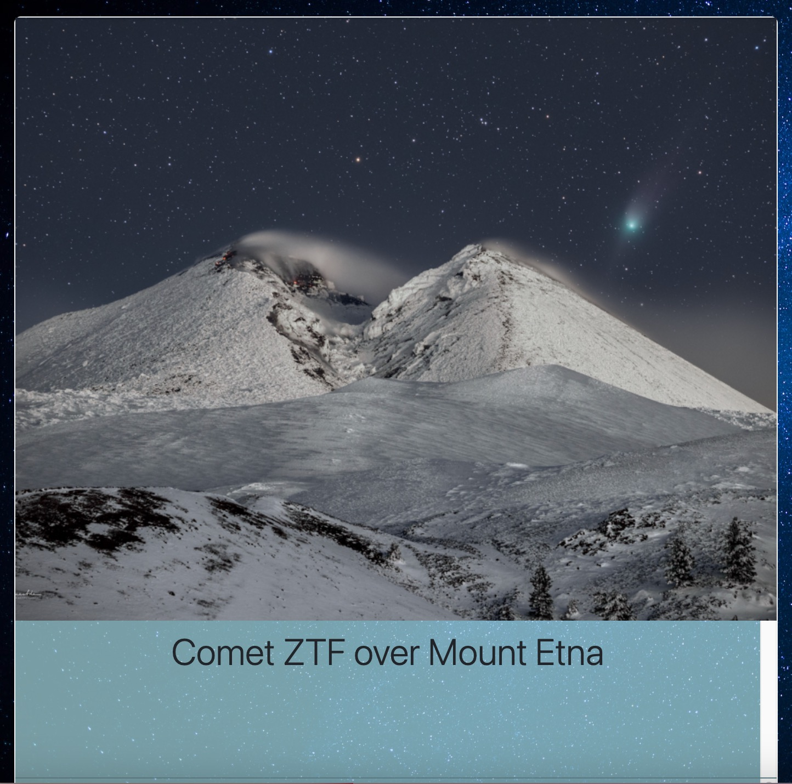
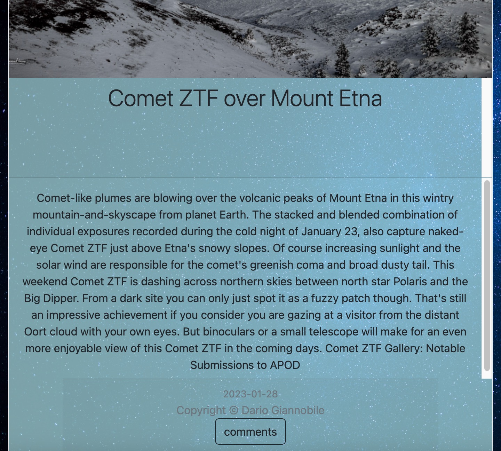

# <span style="color: #9AC1D1;">SpaceBook - Explore the Cosmos</span>

## Overview
SpaceBook is a dynamic web application offering a seamless connection to NASA's Astronomy Picture of the Day (APOD). It intertwines celestial wonders captured by NASA with a secure login interface, providing a rich and engaging user experience.

## Table of Contents

1. [App Previews](#app-previews)
2. [Important Notes](#important-notes)
3. [Description](#description)
4. [Installation](#installation)
5. [Usage](#usage)
6. [Algorithm - Polling Comments](#algorithm---polling-comments)
7. [Credits](#credits)
8. [License](#license)

## App Previews
<table width="100%"> 
  <tr>
    <td width="50%">
      <div align="center">
        <p style="font-family: 'Arial', sans-serif; font-size: 20px; font-weight: bold;">Landing page Preview - Login</p>
        
      </div>
    </td> 
    <td width="50%">
      <div align="center">
        <p style="font-family: 'Arial', sans-serif; font-size: 20px; font-weight: bold;">Registration page Preview</p>
        
      </div>
    </td>
  </tr>
</table>

<table width="100%"> 
  <tr>
    <td width="50%">
      <div align="center">
        <p style="font-family: 'Arial', sans-serif; font-size: 20px; font-weight: bold"> Home page Preview (Light mode)</p>
        
      </div>
    </td> 
    <td width="50%">
      <div align="center">
        <p style="font-family: 'Arial', sans-serif; font-size: 20px; font-weight: bold"> Home page Preview (Dark mode)</p>
        
      </div>
    </td>
  </tr>
</table>

<table width="100%"> 
  <tr>
    <td width="50%">
      <div align="center">
        <p style="font-family: 'Arial', sans-serif; font-size: 20px; font-weight: bold">Card first part</p>
        
      </div>
    </td> 
    <td width="50%">
      <div align="center">
        <p style="font-family: 'Arial', sans-serif; font-size: 20px; font-weight: bold">Card second part</p>
        
      </div>
    </td>
  </tr>
</table>

## Important Notes


### <span style="color: #069DCA;">Configurations</span>
Before running the program, ensure the following configuration is in place:

- **API Key**: 
  * Obtain an API key from [NASA's APOD API](https://api.nasa.gov) [here](https://api.nasa.gov) 
  * replace `const APIKEY = "***";` in the file `public/javascripts/spacebook.js` at line 2 with your generated API key.


### <span style="color: #069DCA;">Startup</span>

To seamlessly initiate the program, follow these steps:

1. **Install Dependencies**: Run the following commands in the project directory:
    ```bash
    npm install
    npm install express
    ```
2. **Database Migration**: Migrate the database schema by running:
    ```bash
    node_modules/.bin/sequelize db:migrate
    ```
3. **Run the Application**: Start the application using either of these commands:
    ```bash
    node app.js
    npm start
    ```

### Recommended Setup

For an optimal setup experience, consider the following suggestions:

- **Browser Compatibility**: Use the latest Chrome or Firefox versions for seamless functionality.
- **Configuration File**: Create a configuration file (e.g., `bin/www`) to customize settings like port allocation and environment variables.
- **Code Editor**: Utilize a code editor supporting JavaScript/Node.js development, such as Visual Studio Code or Atom.

## Description

SpaceBook facilitates a secure login process for users to access NASA's APOD content. 
Ensures data integrity by validating user input.

The APOD section provides a curated view of celestial images with associated information. Error handling and a user-friendly "Load More" feature enrich the browsing experience.

## Usage

### How to Utilize the Application

To effectively use the application, follow these steps:

1. **Login**: Access the login page and enter your credentials (username, password, etc.) to authenticate and gain access to the application features.
2. **Explore APOD**: Navigate to the Astronomy Picture of the Day (APOD) section to view celestial images and associated information after logging in.
3. **Date Selection**: Utilize the date picker or input field to select specific dates for viewing APOD images.
4. **Load More**: Use the "Load More" button to fetch additional images or content for the selected date.
5. **Interaction**: Explore various functionalities like commenting, sharing, or saving favorite images, if available.


## Algorithm - Comment Management and Polling

- Data Retrieval and Deletion: The system employs robust mechanisms to handle comment retrieval and deletion, accommodating user interactions and system requirements. Functions are specifically designed to fetch comments based on timestamps, delete specific comments, and retrieve modified comments since the last polling. Notably, the deletion mechanism in Sequelize adheres to a safe deletion approach, known as "paranoid mode." This mode enables logical deletion of records, preserving them in the database without physical removal.

- Polling Mechanism: The application incorporates a polling mechanism to track modifications in comments since the last poll. This functionality relies on a dedicated function that compares timestamps, enabling the retrieval of comments updated after a specific time.


## Credits

### Acknowledgment and Credits

Acknowledgment to external resources, APIs, and contributors:

- **APIs Used**: The project extends gratitude to NASA's APOD API and any other external APIs that have been integrated into the application for their invaluable resources and data.
- **Individual Contribution***: The development of this project was solely conducted by an individual contributor. No team members were involved in this project's creation.
- **Technologies and Frameworks**: The project leverages several technologies and frameworks, including JavaScript (JS), Node.js, Express, CSS, Bootstrap 5.3, and Sequelize, which have been instrumental in building this application.
- **Database Visualization Tool**: For debugging and visualizing the database, it is recommended to use "DB Browser for SQLite." This tool provides an intuitive interface to inspect the database structure and contents, aiding in debugging and analysis.

*Note: This application follows an MVC (Model-View-Controller) architecture, which organizes the codebase into distinct sections handling data (Model), presentation (View), and application logic (Controller).*

## License

This project operates under the MIT License.
